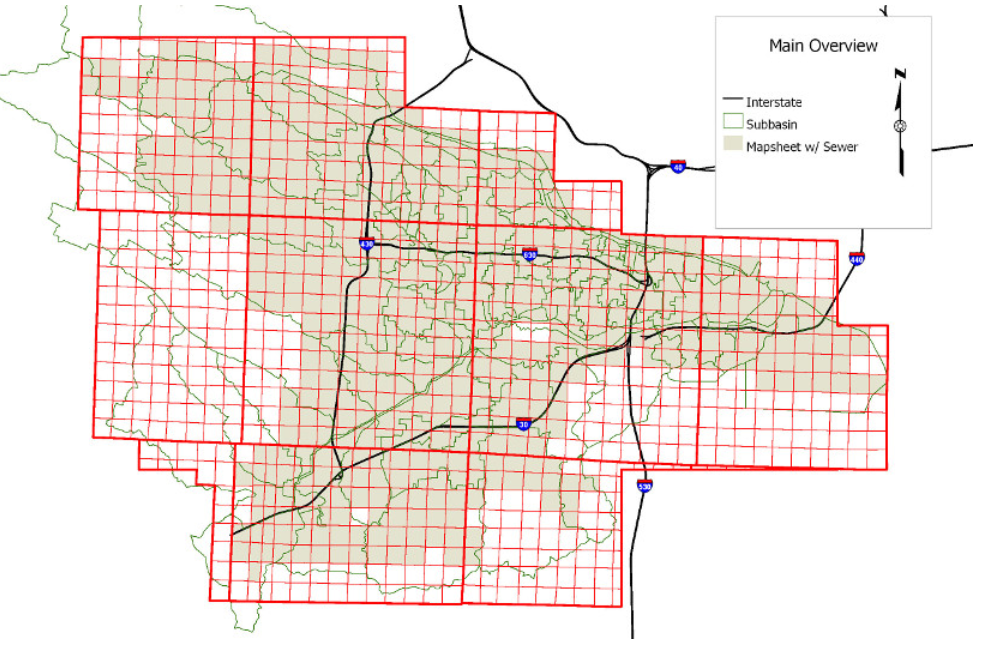
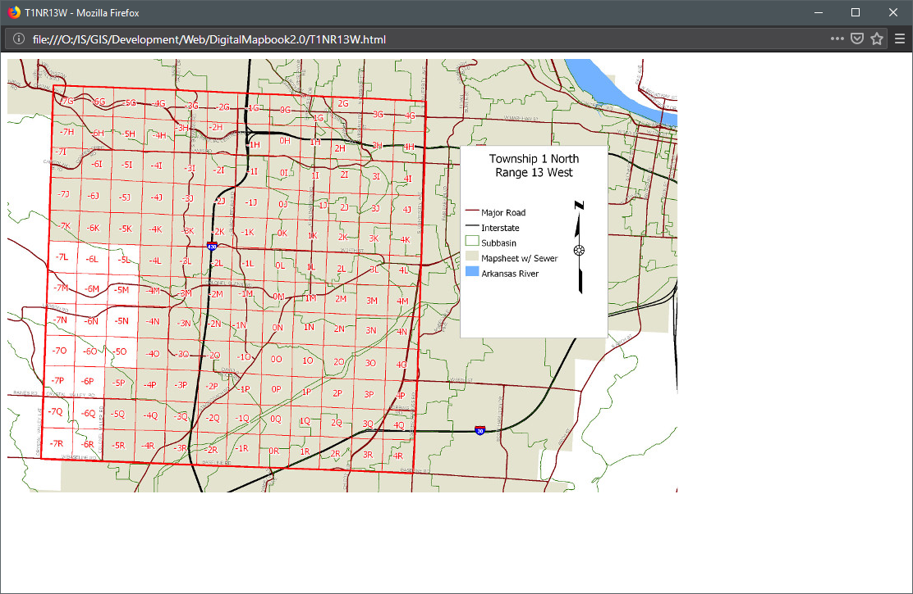
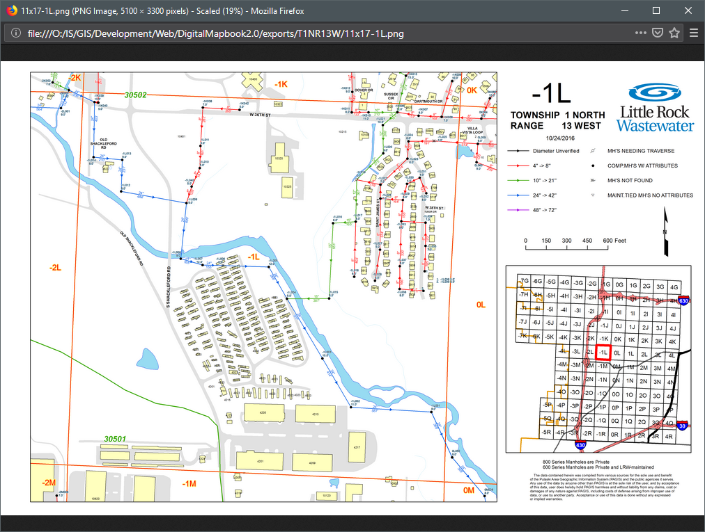

---

---

# DigitalMapbook
This is a bit of a *strange* application to say the least. In late 2016 I was asked if I could create an offline digital mapbook for field crews to replace the large hard copy mapbooks kept in trucks.  One that operated within a web browser (reading local files on the mobile device) without a wireless connection.  This is the result.  

It was designed to be side loaded onto Android tablets.  It also used a third party app ("*Open In Browser*" was what we used) that allowed the devices default browser to read local files (map images).

We used another third party syncing application to push updated map images out to devices when they were connected to the office WIFI.

The application was popular at first.  However, field crews began to favor using my fully interactive web application, on their personal devices, to the this non interactive version.

  

### How To Use Add-In

1. Open the **main.html** file with a web browser.

   

2. Tap/click on a Township-Range in image (delineated by thicker red boundary).

   

3. Tap/click mapsheet you wish to view.

   

